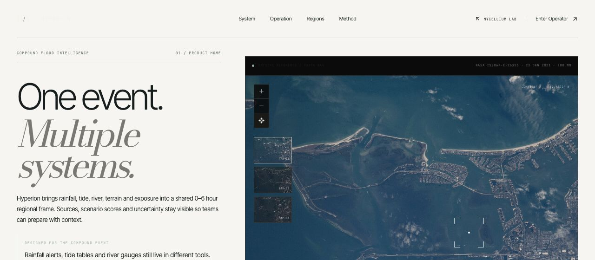

# Hyperion

**Compound flood intelligence — data engineering, modelling and operational decision support.**

Hyperion brings rainfall, coastal water levels, river observations and terrain into a regional operating picture. I built its Python ingestion pipelines, historical event analysis, modelling infrastructure, authenticated service and operator interface within Mycellium Lab.

## Engineering

- **Data pipelines:** NOAA, NWS, USGS and NASA integrations, regional source registries, cached observations and transformation provenance.
- **Modelling:** gradient boosting and XGBoost with feature-leakage inspection, spatial and temporal split contracts, calibration and operational metrics.
- **Runtime:** an authenticated Python HTTP service, expiring sessions, workspace access controls and background jobs with process-level timeout isolation.
- **Interface:** a React/Next.js operator workspace presenting source freshness, event timelines, regional layers and reports.

Live federal hazard observations and historical compound-event analysis are distinct parts of the system. Its regional models are research tools; the architecture keeps data provenance, uncertainty and evaluation boundaries explicit.

## Selected source

This repository presents the architecture and original source excerpts for leakage inspection, split validation and metric calculation. Their origin and hashes are recorded in [SOURCE_PROVENANCE.json](SOURCE_PROVENANCE.json). The complete product implementation remains private.

## Product

[Explore Hyperion](https://www.mycelliumlab.com/hyperion/access) · [Mycellium Lab](https://www.mycelliumlab.com) · [License](LICENSE)
